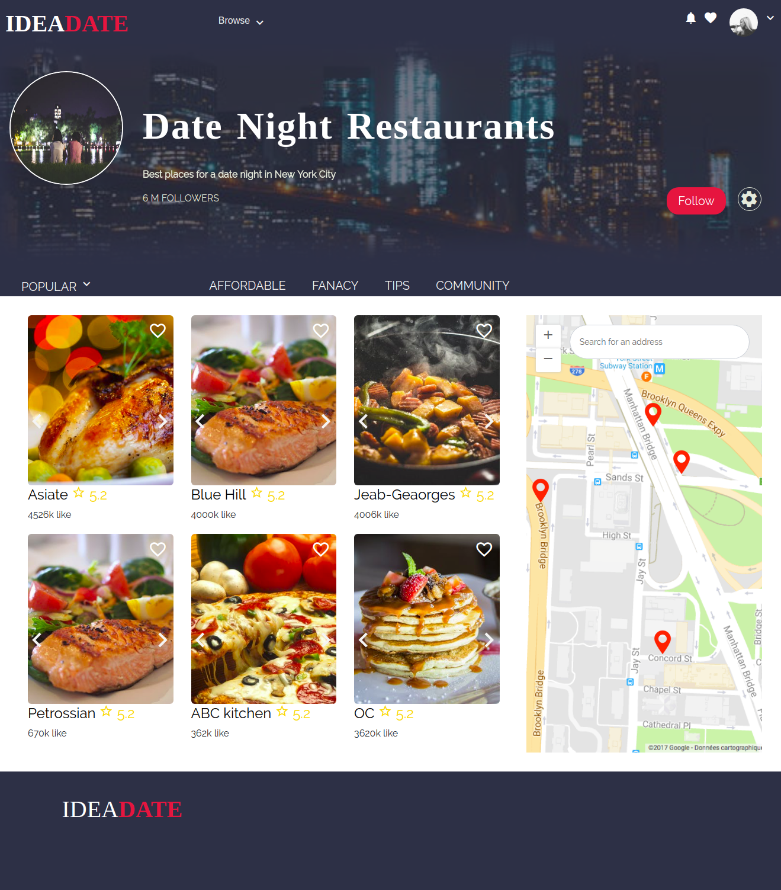
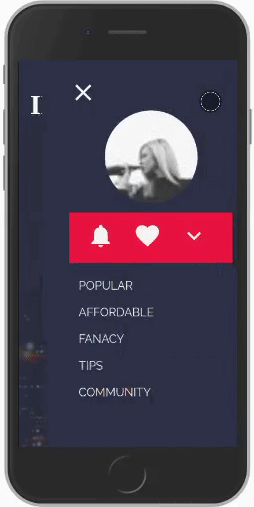

<<<<<<< HEAD
# Front-end Challanege


> A Vue.js project

## Build Setup

``` bash
# install dependencies
npm install

# serve with hot reload at localhost:8080
npm run dev

# build for production with minification
npm run build

# build for production and view the bundle analyzer report
npm run build --report

# run e2e tests
npm run e2e

# run all tests
npm test
```

## [Documentation]()
This template is build with vue.js and bootstrap 4,I used [vue.js](https://vuejs.org/), I can use Angular but I found Vue appropriate for this project because it's a great Framwork for UI and User Experience,so I used vue.js to handle and make nice animation,and has small size too.
in product section I created an Array of object that contain product detail,the way that helped me to handle product displaying ,and make dynamic page with vue-router,So when use click product title ,it go you to detail component with nice transition and blur effect while diplaying product details.
#Like feature : when you click heart icon the like will be add and the icon will take a red color,with like counter that incresse while clicking heart icon.
### Vue.js 2

## Vue-cli
### [bootstrap 4](http://getbootstrap.com/)
bootstrap 4 is latest version off twitter bootstrap ,which is  is an open source toolkit for developing with HTML, CSS, and JS.

I just used the necessary elments for the project to avoid loading the entire Framwork and unsed code
 
 **bootstrap.scss
 ```
 @import "functions";
@import "variables";
@import "mixins";
@import "root";
@import "reboot";
@import "images";
@import "grid";
@import "forms";
@import "buttons";
@import "dropdown";
@import "input-group";
@import "nav";
@import "navbar";
//@import "code";
//@import "tables";
//@import "transitions";
//@import "button-group";
//@import "custom-forms";
//@import "type";
//@import "card";
//@import "breadcrumb";
//@import "pagination";
//@import "badge";
//@import "jumbotron";
//@import "alert";
//@import "progress";
//@import "list-group";
//@import "close";
//@import "modal";
//@import "tooltip";
//@import "carousel";
//@import "utilities";
//@import "print";
```

### Sass

I used sass as CSS processor.

## [Vue-router](https://router.vuejs.org/en/)


 I used Vue-router ,So the user can navigate to detail page without page refresh with a nice animation effect

## The template is responsive


 ### Mobile Menu


### Material icons
I used Material-icons for icons which is free icons, I prefere material-icons good for User Interface instead of fontawesome
## Files are minified

##  Image Carousel


[By Said Hayani]()